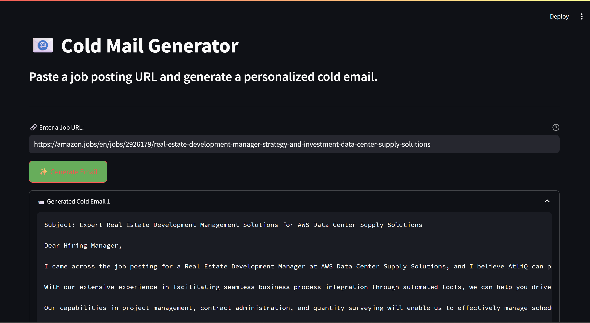

# Cold-email-Genai

📧 Cold Email Generator with GenAI (LLaMA3)
This app uses GenAI (LLaMA3 via LangChain + Groq API) to auto-generate personalized cold emails from job posting URLs. It scrapes the job description, extracts roles and required skills, matches them with AtliQ’s portfolio, and writes smart cold emails — all via AI.

🚀 Features
🔗 Paste any job posting URL

🧠 AI-powered JD parsing

✍️ Auto-generated cold emails

🔍 Matches AtliQ’s portfolio links

💼 Persona: Mohan, BDE at AtliQ

🧰 Tech Stack
Frontend: Streamlit

Backend: Python, LangChain

Model: LLaMA3-70B via Groq API

Scraping: LangChain WebBaseLoader

DB: SQLite3 for portfolio vectors

⚙️ How It Works
User Input: Paste a job URL

Scraping & Parsing: Extract job role and skills

Matching: Fetch related portfolio links

Email Writing: AI writes tailored cold email

🛠️ Setup
bash
Copy
Edit
pip install -r requirements.txt
Create a .env file:

ini
Copy
Edit
GROQ_API_KEY=your_groq_api_key
Run:

bash
Copy
Edit
streamlit run main.py
🧪 Example
URL: https://amazon.jobs/en/jobs/...
Role: Data Analyst
Skills: SQL, Python, Visualization
Links:

atliq.com/projects/data-dashboard

atliq.com/projects/sql-automation

Email:
Hi, I’m Mohan from AtliQ... (AI-generated)

💡 Why This?
This project saves hours for sales teams by using LLMs to craft job-specific outreach — boosting engagement and conversion in B2B sales.

